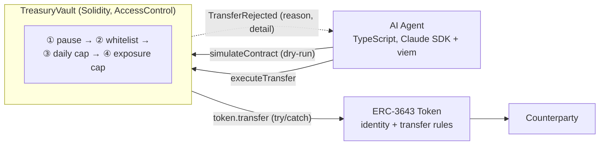

# Compliant RWA Treasury with an AI Agent

A treasury vault holds ERC-3643 security tokens. An AI agent proposes
transfers, but the vault treats it as an untrusted caller: four deterministic
on-chain gates (pause, counterparty whitelist, daily cap, per-asset exposure
cap) run before the token's own ERC-3643 compliance layer makes the final
call. If the agent hallucinates or gets manipulated, the contract blocks the
move at the gate layer.

The agent (TypeScript, Claude Agent SDK + viem) wraps the vault as an MCP
server with three tools - read holdings, simulate a transfer, submit one -
and is required by its system prompt to simulate before executing. The
reasoning it emits off-chain is observability, not authorization.

---

## Status

The vault and policy gates are complete (33 unit tests across 5 suites). The
agent runtime is wired up against a local Anvil stack with all three MCP
tools functional. Sepolia config is the next step.

Not audited. Not for production use.

---

## Architecture

Three layers, none trusting the layer above: the agent proposes a transfer,
the vault gates it through four deterministic policies, the ERC-3643 token
enforces identity-level compliance.



Each gate emits `TransferRejected(reason, detail)` instead of reverting, so
the agent reads the outcome off-chain without parsing revert bytes.
Successful transfers emit `TransferExecuted` and update the daily counters
atomically with the token transfer.

Component responsibilities, the full transfer flow, and the policy gate
reference are in [`docs/architecture.md`](docs/architecture.md).

---

## Design notes

- **One outcome stream.** The vault wraps `token.transfer` in try/catch and
  emits `TransferRejected(reason, detail)` with the original revert bytes
  preserved in `detail`. Its own policy gates emit the same event. The agent
  reads one structured event off-chain, not a mix of reverts and successes.
- **Defense in depth.** Four cheap on-chain checks run before the more
  expensive ERC-3643 call. The vault owns the tokens, so the agent has no
  path that skips the gates.
- **Counters update on success only.** `_dailySpent` and `_assetDailySpent`
  are written after `token.transfer` returns true. A rejected ERC-3643 call
  leaves the counters untouched (verified by
  `test_executeTransfer_erc3643Rejects_dailyCapNotConsumed`).
- **Two-phase simulation in the agent.** Some failures revert (`VaultPaused`,
  unauthorized caller), others emit events (whitelist, daily cap, exposure
  cap, ERC-3643 reject). `check_transfer_feasibility` runs both
  `simulateContract` and `simulateCalls` so the model sees the same outcome
  an on-chain submission would produce.

---

## Quick start

Requires Foundry and Node.js 20+.

```bash
git submodule update --init --recursive
cd contracts && forge build && forge test -vv
```

Local end-to-end stack (Anvil + deployed vault + funded mock token):

```bash
./scripts/local-dev.sh
```

The script starts Anvil, deploys `TreasuryVault` and `MockERC3643`,
whitelists two counterparties, sets an exposure cap, and writes addresses to
`deployments/local.json`. Anvil runs until you Ctrl+C.

Agent (with the local stack running):

```bash
cd agent && npm install
npm start "show the vault holdings"
npm start "transfer 500 MOCK to cp1"
```

See [`agent/README.md`](agent/README.md) for the agent details.

---

## Stack

| Layer     | Tooling                                                               |
| --------- | --------------------------------------------------------------------- |
| Contracts | Solidity 0.8.28, Foundry, OpenZeppelin `AccessControl`                |
| Token     | ERC-3643 (T-REX) interface; `MockERC3643` for local tests             |
| Agent     | TypeScript (strict), Node 20+, viem, `@anthropic-ai/claude-agent-sdk` |
| CI        | GitHub Actions: `forge build` + `forge test`, `tsc --noEmit`          |

---

## Repository layout

```
contracts/
  src/TreasuryVault.sol         policy gate + ERC-3643 delegation
  src/interfaces/IERC3643.sol   minimal T-REX interface
  test/unit/                    33 unit tests across 5 suites
  test/mocks/MockERC3643.sol    test double with toggleable compliance
  script/DeployLocal.s.sol      local Anvil deployment

agent/
  src/index.ts                  MCP server + Claude Agent SDK query loop
  src/tools/                    get_portfolio, check_transfer_feasibility, execute_transfer
  src/prompt.ts                 system prompt: simulate-before-execute, reject-reason mapping

docs/
  architecture.md               component layout, transfer flow, gate reference

scripts/
  local-dev.sh                  Anvil + deploy + write deployments/local.json
```

---

## Tests

```bash
cd contracts
forge test -vv         # full suite, verbose
forge test --summary   # pass/fail summary
```

Five suites cover the four policy gates and the ERC-3643 integration:

| Suite                                   | Focus                                         |
| --------------------------------------- | --------------------------------------------- |
| `TreasuryVault.Skeleton.t.sol`          | Constructor, roles, pause / unpause           |
| `TreasuryVault.Whitelist.t.sol`         | Counterparty add / deactivate, whitelist gate |
| `TreasuryVault.DailyCap.t.sol`          | Per-counterparty daily cap, day-bucket reset  |
| `TreasuryVault.ExposureCap.t.sol`       | Per-asset daily exposure cap                  |
| `TreasuryVault.ERC3643Compliance.t.sol` | try/catch on the token's compliance check     |

---

## License

MIT - see [`LICENSE`](LICENSE).
