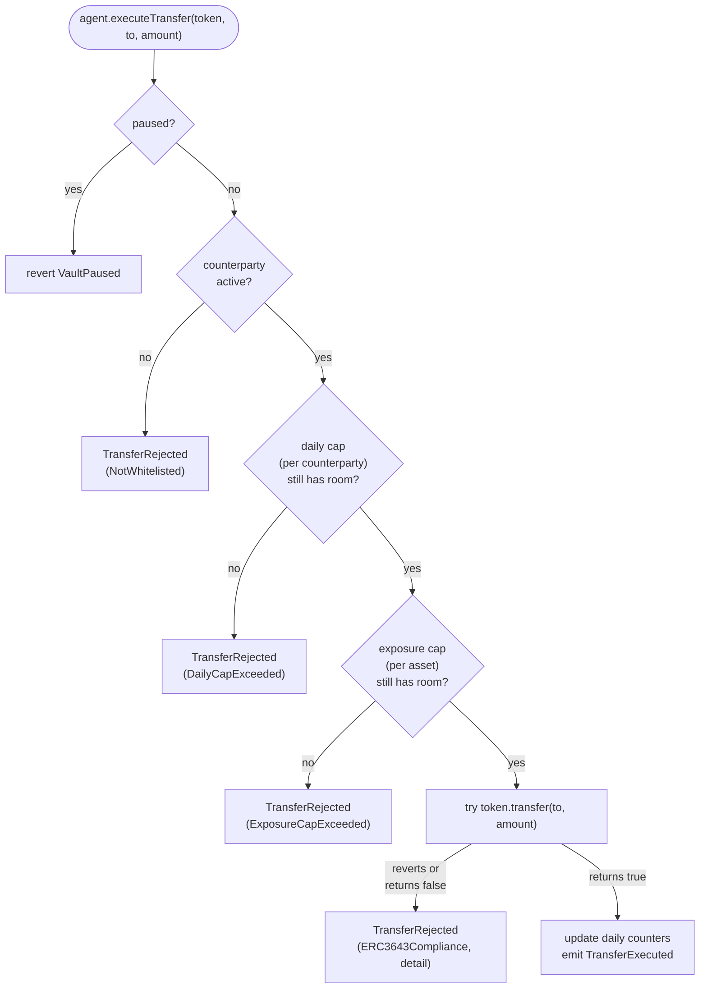

# Architecture

This document describes how `rwa-treasury-agent` is put together: the three
layers, the responsibilities of each component, the transfer flow through the
policy gates, and the trust assumptions behind it.

---

## Three layers

The system has three layers, each one untrusted by the layer below.

| Layer       | Component                | Responsibility                                                                  |
| ----------- | ------------------------ | ------------------------------------------------------------------------------- |
| Reasoning   | TypeScript agent         | Decide what transfer to attempt; explain the on-chain outcome in plain language.|
| Policy      | `TreasuryVault.sol`      | Enforce four deterministic gates; own the tokens; emit a structured outcome.    |
| Compliance  | ERC-3643 (T-REX) token   | Identity / claim / jurisdiction checks at the token level.                      |

The agent never holds tokens and is not trusted to follow rules. The vault
holds the tokens and is the only path to move them. The token has the final
say - even a vault-approved transfer can be blocked by ERC-3643 compliance.

---

## Components

| Component                 | Role                                                                                                                       | Lives in                       |
| ------------------------- | -------------------------------------------------------------------------------------------------------------------------- | ------------------------------ |
| `TreasuryVault.sol`       | Holds ERC-3643 tokens. Enforces four policy gates. Calls the token's `transfer` and surfaces the outcome as an event.      | `contracts/src/`               |
| `IERC3643.sol`            | Minimal interface used by the vault - `transfer`, `transferFrom`, `balanceOf`. Intentionally narrow.                       | `contracts/src/interfaces/`    |
| `MockERC3643.sol`         | Test double: ERC-20 with a flag that toggles `transfer` reverts to simulate ERC-3643 compliance failures.                  | `contracts/test/mocks/`        |
| TypeScript agent          | MCP server exposing three tools to a Claude model (read holdings, simulate, submit). System prompt requires simulate before execute and maps `RejectReason` back to plain language. | `agent/src/` |
| `DeployLocal.s.sol`       | Foundry script: deploys both contracts, funds the vault, whitelists two counterparties, sets an exposure cap.              | `contracts/script/`            |
| `scripts/local-dev.sh`    | Starts Anvil, runs the deploy script, parses output, writes `deployments/local.json`.                                      | `scripts/`                     |

---

## Roles

The vault uses OpenZeppelin `AccessControl` with three role-gated capabilities.

| Role                 | Granted by  | Capabilities                                                                       |
| -------------------- | ----------- | ---------------------------------------------------------------------------------- |
| `DEFAULT_ADMIN_ROLE` | Constructor | Grant and revoke other roles.                                                      |
| `TREASURER_ROLE`     | Admin       | `addCounterparty`, `deactivateCounterparty`, `setExposureCap`.                     |
| `AGENT_ROLE`         | Admin       | `executeTransfer` - the only on-chain entry point that moves tokens.               |
| `PAUSER_ROLE`        | Admin       | `pause`, `unpause`.                                                                |

The constructor grants all four roles to the deployer for convenience in the
local stack and tests. A production deployment would split them: Treasurer =
multisig, Pauser = fast-response key, Agent = the agent's wallet.

---

## Transfer flow

`executeTransfer(token, to, amount)` runs four gates in a fixed order. Each
gate either rejects the transfer (emit `TransferRejected`, return) or allows
it through to the next gate. The pause check is the only one that reverts;
all four policy gates emit instead.

Two design choices are worth flagging:

1. **Rejected transfers do not revert (except pause).** They emit a
   structured event so the agent can read the reason off-chain without
   parsing revert bytes. The agent layer treats `TransferRejected` as a
   normal outcome, not an error.
2. **Counters update only on success.** `_dailySpent[to][day]` and
   `_assetDailySpent[token][day]` are written *after* `token.transfer`
   returns true. A rejected ERC-3643 call leaves the counters untouched
   (verified by `test_executeTransfer_erc3643Rejects_dailyCapNotConsumed`).

For the source, see
[`contracts/src/TreasuryVault.sol:102-137`](../contracts/src/TreasuryVault.sol).

---

## Policy gates - reference

| Gate | Stored as                                       | Configured by               | Behaviour                                                                                                              |
| ---- | ----------------------------------------------- | --------------------------- | ---------------------------------------------------------------------------------------------------------------------- |
| 1    | `bool _paused`                                  | `pause` / `unpause`         | Reverts `VaultPaused` if set. Hard stop - applies to every transfer attempt.                                           |
| 2    | `mapping(address => Counterparty) _counterparties` | `addCounterparty` / `deactivateCounterparty` | Recipient must have `active == true`. Deactivation is soft (preserves `addedAt` for audit).                            |
| 3    | `mapping(address => mapping(uint256 => uint256)) _dailySpent` | `addCounterparty(.., dailyCap)` | Per-counterparty per-day cap. Day bucket is `block.timestamp / 1 days`. Cap of zero means no transfer allowed.         |
| 4    | `mapping(address => uint256) _exposureCaps` and `_assetDailySpent` | `setExposureCap`             | Per-asset per-day outflow cap. `cap == 0` means unlimited. Aggregates across all counterparties for that token.        |
| 5    | (delegated)                                     | the token contract          | `try token.transfer(to, amount)` - captures revert bytes in `detail`, or rejects on `false` return.                    |

Reject reasons are carried in the `RejectReason` enum on the
`TransferRejected` event so an off-chain reader can branch on them without
string parsing.

---

## Why ERC-3643 (T-REX)

ERC-3643 (T-REX) is a standard for permissioned security tokens. The token
itself enforces identity-bound rules (KYC claim, jurisdiction, investor
type, transfer rules) via an attached compliance contract and an
`ONCHAINID`. A `transfer` call can revert if the recipient lacks a required
claim or violates a transfer rule.

The vault uses only the narrow surface needed for the policy work
(`transfer`, `transferFrom`, `balanceOf`) and treats compliance failures as
an outcome rather than an exception. This keeps the contract independent of
any specific compliance-module implementation while still slotting into a
real T-REX deployment.

---

## Trust model

| Component                  | Trusted to                                                     | Not trusted to                                            |
| -------------------------- | -------------------------------------------------------------- | --------------------------------------------------------- |
| Agent (TypeScript)         | Propose a transfer, simulate it, explain the resulting event.  | Choose recipients, choose amounts, bypass any gate.       |
| `TreasuryVault.sol`        | Apply gates 1–4 in order. Emit a faithful outcome event.       | Decide jurisdiction / KYC / transfer-rule compliance.     |
| ERC-3643 token             | Final compliance decision (identity, claims, transfer rules).  | Provide reasoning suitable for off-chain explanation.     |
| Treasurer / Pauser keys    | Hold the configuration authority and the kill-switch.          | (Out of scope for this PoC - assumed non-malicious.)      |

The reasoning the agent emits off-chain is observability, not authorization.
The contract makes no assumption that the caller is honest, correct, or even
deterministic.

---

## Out of scope

These are deliberate omissions for the current iteration. They would be
required for a production deployment but are not part of the design goal,
which is to validate the three-layer policy + agent integration.

- **Multisig admin / timelocks.** All four roles are granted to a single
  EOA at construction.
- **`SafeERC20`.** The vault calls `token.transfer` directly inside
  `try`/`catch`. A real T-REX integration would use the safe wrapper.
- **`ONCHAINID` on the vault itself.** The vault is a contract holder; some
  compliance modules require an attached ONCHAINID for the contract.
- **Mainnet or Sepolia deployment.** Currently local Anvil only. Sepolia
  is planned.

---

## Where to look in code

| Concern                                              | File                                                                                                                            |
| ---------------------------------------------------- | ------------------------------------------------------------------------------------------------------------------------------- |
| Policy gates in order, event emissions, role checks  | [`contracts/src/TreasuryVault.sol`](../contracts/src/TreasuryVault.sol)                                                         |
| ERC-3643 surface used by the vault                   | [`contracts/src/interfaces/IERC3643.sol`](../contracts/src/interfaces/IERC3643.sol)                                             |
| Test double with toggleable compliance reverts       | [`contracts/test/mocks/MockERC3643.sol`](../contracts/test/mocks/MockERC3643.sol)                                               |
| Counters-not-consumed-on-reject test                 | [`contracts/test/unit/TreasuryVault.ERC3643Compliance.t.sol`](../contracts/test/unit/TreasuryVault.ERC3643Compliance.t.sol)     |
| Local deployment script                              | [`contracts/script/DeployLocal.s.sol`](../contracts/script/DeployLocal.s.sol)                                                   |
| Anvil bootstrap + deployment-info writer             | [`scripts/local-dev.sh`](../scripts/local-dev.sh)                                                                               |
| MCP server entry point + query loop                  | [`agent/src/index.ts`](../agent/src/index.ts)                                                                                   |
| Two-phase simulation (revert + event logs)           | [`agent/src/tools/check-transfer.ts`](../agent/src/tools/check-transfer.ts)                                                     |
| System prompt with policy rules                      | [`agent/src/prompt.ts`](../agent/src/prompt.ts)                                                                                 |
